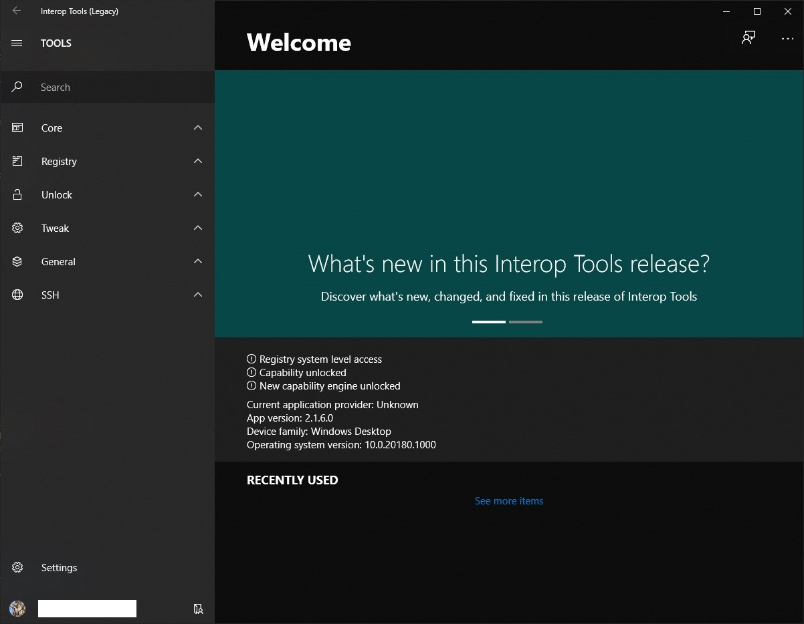
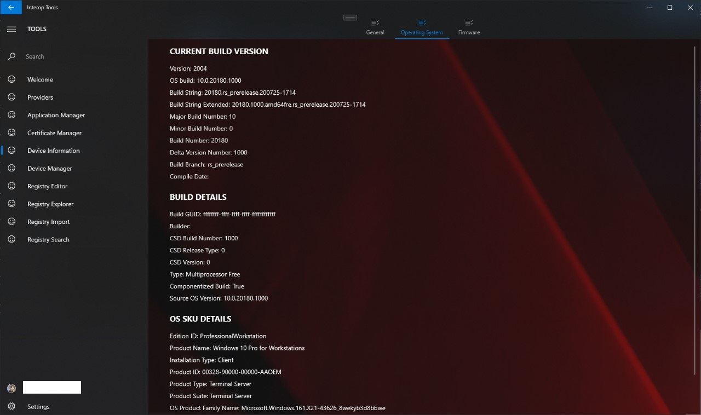

# Interop Tools
Source code release of the old Interop Tools app, as is, including the code I find very ugly today.

Interop Tools was made around 2015 to allow people to edit the registry on their Windows 10 Mobile devices, it grew into a project that became larger than what I originally expected for an app I did quickly put together, and the code does show how quickly it was also put together. This has no models, and contains a lot of code hacks. But I didn't want to release this modified either. This is getting released to preserve history, and following some people interest for old download links. Maybe someone will pick this back up, maybe not, at least this won't get lost...

## A few notes

This repository contains two branches:
* InteropTools
* InteropToolsv2

### InteropTools branch

The former contains the source code of the original application distributed on various channels, XDA and Store mainly. It has a few issues, but here's how to get going today:

You will need the following SDKs:
* 10240
* 14393
* 15063
* 16299

C++ building tools are a must.

Due to an issue in the app, which I never got around to fix, it can only be ran in Release configuration, or ReleaseStore configuration. if someone figures out the problem, you are my guest!

You may have to expand InteropTools/UI/Microsoft.UI.Xaml-1.17081.170906002-nuget170811709061708.zip in order to get this to build, as the build process needs these files both in the root UI folder, and in UI/Libs.

### InteropToolsv2 branch

The later branch contains the beginning of a rewrite, codenamed Farewell (heh sad coincidence, I know) which I never finished. It is much cleaner code overall, and focused on cleaning up the UI code. It can be ran fine, as long as you got all SDKs installed; It originally didn't, but I commented out the crashy bit for release, that the former branch had, it's related to the TreeView control. I commented that out a few years ago..

## Credits

* A lot of friends who provided support for a lot of years while this app was alive, you guys rock and without you, this app and the entire ride wouldn't have existed.
* Jeremy Sinclair over the XDA forums who also provided a huge help while making this app, and a huge friend I can't live without, even if he still complains about his Pro X online, every week.
* The entire WP XDA Dev community who helped a lot and where I had a great time talking with :)
* Rye from the Ring of Lightning Network circa 2016 for his help with NdtkLib (No idea what he's up to today...)
* The entire team behind Inside Windows, which at the time hosted a website and provided help with hosting binaries of the app. The telegram group is still alive and kicking today, check it out @insidewindows on telegram if you want to have some fun with us.
* You! for using this app back when it was alive, and back when Windows 10 Mobile was alive, yeah, years have passed.
* Some people I surely forgot!

This app uses a Library called Intense, released under the MIT license as the base of its UI, although it has been slightly modified over the years to fit my needs.

## Final words

I am releasing today in hopes this app and its history gets preserved, even if I do not like its source today, and if i had to redo it, I would do it very differently. I hope people interested in this will have as much fun time as I did making it, looking at how things work, or improving it (maybe?).

Sleep well, WP.
